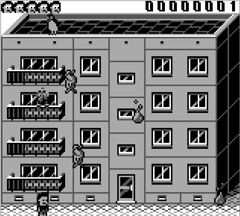

# CatnipMadness

Game made during [Global Game Jam](https://globalgamejam.org/) 2024

GGJ game site: https://globalgamejam.org/games/2024/catnip-madness-3

## Tech

Game is made in pure assembler for Nintendo Gameboy console (compatible with Gameboy Color)

### Tools

- Make (for build)
- rgbasm, rgblink, rgblink, rgbfix (compiler, linker etc.) from https://rgbds.gbdev.io/
- Aseprite (tiles, sprites)

## Play

You can play the game [here](https://www.envysoftware.pl/projects/CatnipMadness/)

Use left arrow (<-) to left and right arrow (->) to move right. Catch falling cats and avoid pigeon 'missiles'

## Credits

- Code by me
- Sprites (GGJ version) by [Senitt](https://github.com/Senitt)
- Sprites (current version) by Szczuro
- Online emulator by [binjgb](https://github.com/binji/binjgb)
